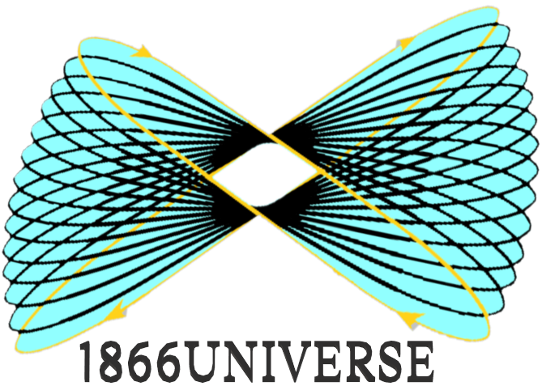

<div align="left">
  
  
</div>

<div align="center" markdown="1">

**English** • [فارسی](README_FA.md)
</div>

# 1866universe

> A boundless, multidisciplinary essence - synthesizing knowledge across linguistics, calendrical science, and human-computer interaction. Belonging to all humanity.

---

## Featured Repositories

<!-- REPO-LIST:START -->

| Repository | Description / Focus | Primary Domain |
| :--- | :--- | :--- |
| [lingodirect-config](https://github.com/1866universe/lingodirect-config) | Configuration schemas, runtime specifications, and orchestration protocols for the LingoDirect translation engine. | Computational-Linguistics |
| [samavi-calendar](https://github.com/1866universe/samavi-calendar) | An astronomical research calendar model based on lunar angular cycles and 232,849 celestial data points across 693 astronomical years (1950–2610). | Astronomy |
| [ebook-Word-by-Word.Positional.Sequential.Mapping](https://github.com/1866universe/ebook-Word-by-Word.Positional.Sequential.Mapping) | A structural framework for Word-by-Word Positional-Sequential Mapping, facilitating precise cross-lingual semantic alignment and linguistic analysis. | Cross-Lingual |

<!-- REPO-LIST:END -->

---

## 🔔 Receive Update Notifications

Get notified when new research, releases, and artifacts are published:

| Action | How-To | Result |
| :--- | :--- | :--- |
| **Star Repository** | Click on the button with the label [Star](https://github.com/1866universe/1866universe) in the top toolbar (next to the Fork button) | Saves this repository to your GitHub stars and profile |
| **Get All Notifications** | Click [Watch](https://github.com/1866universe/1866universe/subscription) and select **Watching** | Receive all notifications and updates from this repository |
| **Releases Only** | Click [Watch](https://github.com/1866universe/1866universe/subscription), select `Custom`, and check **Releases only** | Get notified only for new releases (e.g., ebooks, datasets) or when mentioned |
| **Follow ➕** | Follow the [1866universe](https://github.com/1866universe) account | New public projects will appear in your GitHub feed |
| **RSS Feed (Guest Access)** | See the section **"Not a GitHub member?"** below 👇 | Receive updates via any feed reader (Feedly, Inoreader, etc.) |

> **Not a GitHub user?** No problem; you can still follow updates without even having an account. Simply copy the **RSS Feed URL** below and use extensions like *RSS Feed Reader* or *Feedbro* in Chrome or to automatically stay informed about register on any site to automatically stay informed about the latest updates.
>
> **RSS Feed URL:**
>
> ```text
> https://raw.githubusercontent.com/1866universe/1866universe/main/feed.xml
> ```

## How to Install and Activate RSS Feed Reader in Chrome

To use the feed above in Google Chrome, follow these steps:

1. **Install the Extension:** First, add the [RSS Feed Reader](https://chromewebstore.google.com/detail/rss-feed-reader/pnjaodmkngahhkoihejjehlcdlnohgmp) extension from the Chrome Web Store (**Add to Chrome**).
2. **Access the Extension:** Click on the **Extensions icon** (the puzzle piece 🧩) in your browser's toolbar and select **RSS Feed Reader** from the list.
3. **Login without an account:** To ensure maximum privacy and speed, click on **Continue without account** in the opened window.
4. **Add the Feed:** On the extension's main page, click the **Add Feeds** button and paste the following URL into the search box:

   ```text
   https://raw.githubusercontent.com/1866universe/1866universe/main/feed.xml
   ```

5. **Follow:** Once the **1866universe - Centralized Ecosystem Feed** page information is displayed, click the **Follow** button.

**Done!** From now on, every new event or update in the **1866universe** ecosystem will be displayed directly in your browser.

---

## Research Portal & Network

* **Interactive Research Portal:** [1866universe on Notion](https://rounded-position-bbf.notion.site/1866universe-3d27e46ad8778087b894d1d18834bb46?source=copy_link)
* **Official Inquiries:** `admin@1866universe.ir`

---

<br>

<div align="center">
  <sub>1866Universe 2026 © - a multidisciplinary essence, not a person.</sub>
</div>
