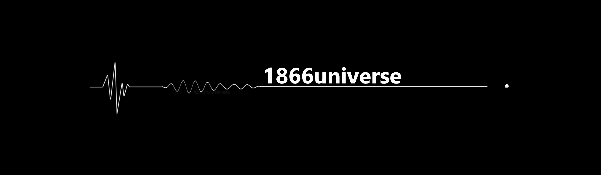

  

# 1866universe

> A boundless, multidisciplinary essence — synthesizing knowledge across linguistics, calendrical science, and human–computer interaction.
> Belonging to no one. Belonging to all humanity.

## Featured Repositories

| Repository | Focus & Doctrine | Domain |
|---|---|---|
| [samavi-calendar](https://github.com/1866universe/samavi-calendar) | Astronomical research model and bilingual documentation | Calendrical Science |
| [lingodirect-config](https://github.com/1866universe/lingodirect-config) | Live bilingual translation and contextual communication infrastructure | Human–Computer Interaction |
| [ebook-Word-by-Word.Positional.Sequential.Mapping](https://github.com/1866universe/ebook-Word-by-Word.Positional.Sequential.Mapping) | Examining and analyzing linguistic structures through Positional–Sequential Mapping | Linguistics |

## Contact & Network

- **Official Inquiries:** `admin@1866universe.ir`

---

  <strong>1866universe</strong> — a multidisciplinary essence, not a person.

